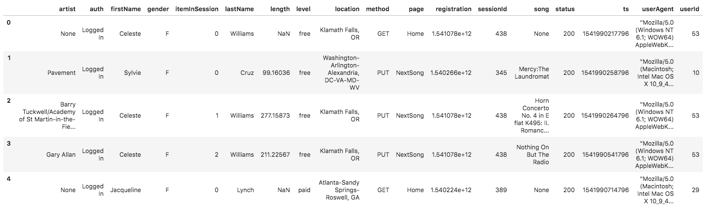
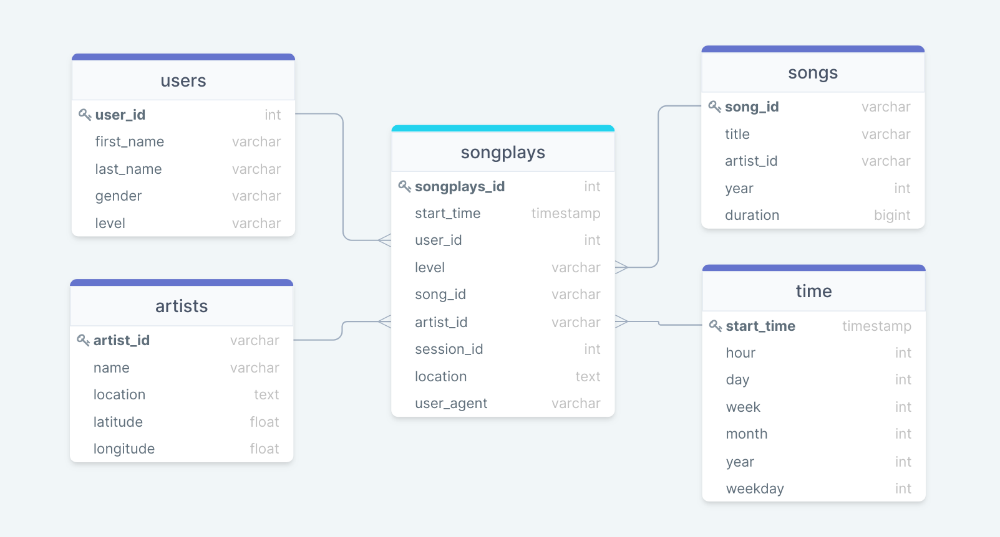

# Project: Data Modeling with Postgres

### Introduction
A startup called Sparkify wants to analyze the data they've been collecting on songs and user activity on their new music streaming app. The analytics team is particularly interested in understanding what songs users are listening to. Currently, they don't have an easy way to query their data, which resides in a directory of JSON logs on user activity on the app, as well as a directory with JSON metadata on the songs in their app.
They'd like a data engineer to create a Postgres database with tables designed to optimize queries on song play analysis, and bring you on the project.

### Project Description
1. Define fact and dimension tables for a star schema.
2. Write an ETL pipeline that transfers data from files in two local directories into these tables in Postgres using Python and SQL.

### Project Dataset

#### Song Dataset
The first dataset is a subset of real data from the Million Song Dataset. Each file is in JSON format and contains metadata about a song and the artist of that song. The files are partitioned by the first three letters of each song's track ID. For example, here are file paths to two files in this dataset.
```
song_data/A/B/C/TRABCEI128F424C983.json
song_data/A/A/B/TRAABJL12903CDCF1A.json
```
And below is an example of what a single song file, TRAABJL12903CDCF1A.json, looks like.

```
{"num_songs": 1, "artist_id": "ARJIE2Y1187B994AB7", "artist_latitude": null, "artist_longitude": null, "artist_location": "", "artist_name": "Line Renaud", "song_id": "SOUPIRU12A6D4FA1E1", "title": "Der Kleine Dompfaff", "duration": 152.92036, "year": 0}
```

#### Log Dataset
The second dataset consists of log files in JSON format generated by this event simulator based on the songs in the dataset above. These simulate activity logs from a music streaming app based on specified configurations.

The log files in the dataset you'll be working with are partitioned by year and month. For example, here are filepaths to two files in this dataset.
```
log_data/2018/11/2018-11-12-events.json
log_data/2018/11/2018-11-13-events.json
```
And below is an example of what the data in a log file, 2018-11-12-events.json, looks like.


### Project Template
Project files<br>

1. `test.ipynb`: displays the first few rows of each table to let you check your database.
2. `create_tables.py`: drops and creates your tables. Run this file to reset tables before each time you run your ETL scripts.
3. `etl.ipynb`: reads and processes a single file from `song_data` and `log_data` and loads the data into your tables. This notebook contains detailed instructions on the ETL process for each of the tables.
4. `etl.py`: reads and processes files from `song_data` and `log_data` and loads them into the tables. Can fill this out based on your work in the ETL notebook.
5. `sql_queries.py`: contains all sql queries, and is imported into the last three files above.
6. `README.md`: provides discussion on the project.

### Database Schema Design



#### Fact Table:
1. ***songplays***: records in log data associated with song plays i.e. records with page NextSong
        -songplay_id, start_time, user_id, level, song_id, artist_id, session_id, location, user_agent
        
#### Dimension Tables
1. ***users*** - users in the app
        -user_id, first_name, last_name, gender, level
2. ***songs*** - songs in music database
        -song_id, title, artist_id, year, duration
3. ***artists*** - artists in music database
        -artist_id, name, location, latitude, longitude
4. ***time*** - timestamps of records in songplays broken down into specific units
        -start_time, hour, day, week, month, year, weekday

### ETL pipeline

The ETL pipeline will process the data from JSON files `song_data` and `log_data` to create database using Python and SQL.
`song_data` To create the songs and artists dimensional tables.
`log_data` To create the time and users dimensional tables, as well as the songplays fact table.

### How to run the Python Scripts

#### To create tables
1. Run `create_tables.py` to create your database and tables.
  ``` python create_tables.py```
  
#### To run ETL pipeline
2. Run `etl.py`, Remember to run `create_tables.py` before running `etl.py` to reset your tables.
  ``` python etl.py```

3. Run `test.ipynb` to confirm your records were successfully inserted into each table.

### Example query

```
SELECT count(*) FROM songs
```
